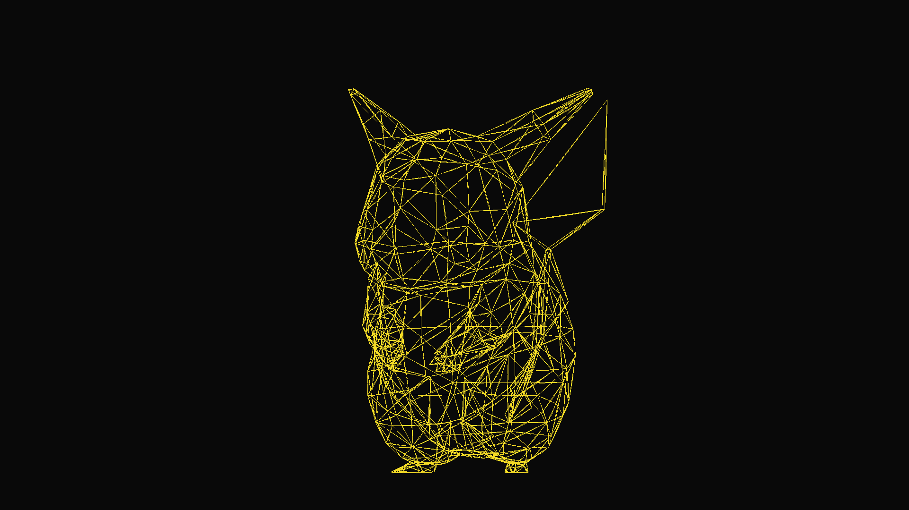

3D Model Render using C++, from scratch, this renderer gets a 3D model in OBJ format and creates the image in PPM format, tracing each line and making the adjustment for the perspective camera, no textures implemented yet, only edges.

Example:

